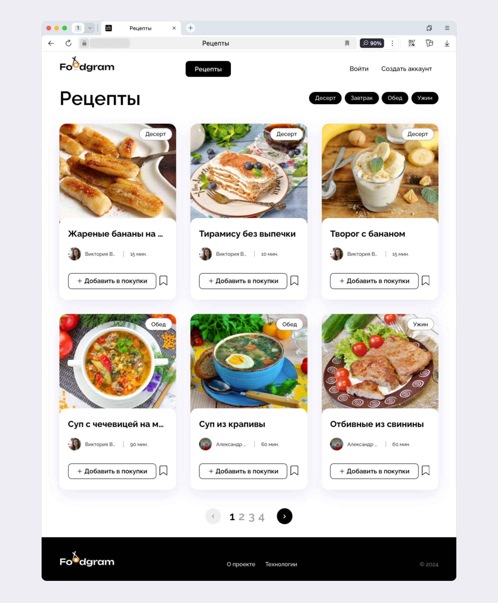
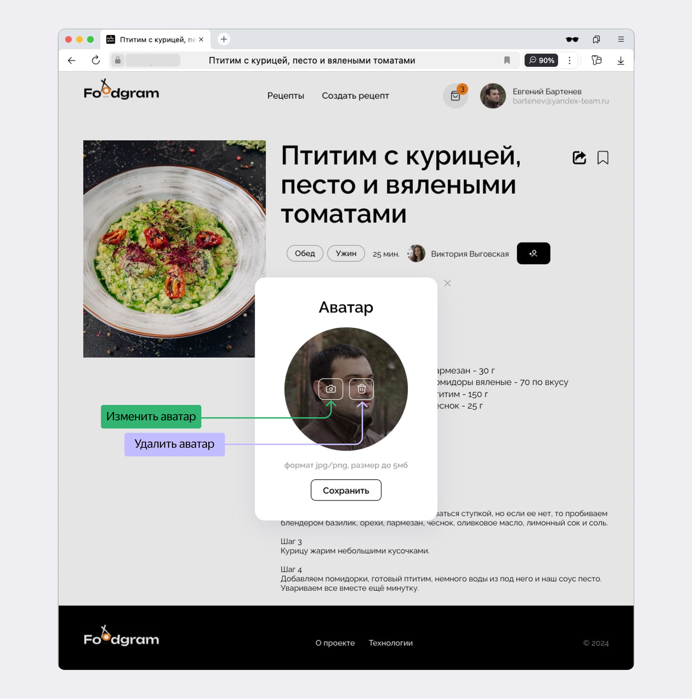

# APPetite

## Project Description

APPetite is a full-stack web application developed as part of the Yandex Practicum training program. It serves as a comprehensive example of modern web development, combining both backend and frontend technologies.

The backend is built with the Django framework, and the frontend is implemented as a Single Page Application (SPA) using React, providing a fast and seamless user experience.

APPetite allows users to share their favorite recipes, discover new dishes, follow other users, add recipes to favorites, and automatically generate shopping lists based on selected meals. It functions as a culinary social network, combining inspiration with practical tools.

The project showcases skills in REST API development, user authentication, filtering, business logic, and responsive UI design. It includes features like tag-based filtering, image uploading, pagination, and real-time ingredient search.

The infrastructure is fully containerized using Docker and managed with docker-compose, ensuring smooth deployment and scalability. It uses PostgreSQL for the database, Nginx for serving static and media files, and includes a CI/CD pipeline configured with GitHub Actions.

Additionally, the project includes Postman test collections to verify the API endpoints and support automated or manual testing during development and review.


### Key Features

- **Recipe Publishing:** Create and share recipes with detailed ingredients, steps, and photos.
- **Recipe Editing:** Edit your published recipes.
- **Favorites:** Add recipes to your favorites for quick access.
- **Shopping List:** Add ingredients from recipes to a shopping list, with automatic quantity calculation.
- **Download Shopping List:** Download your shopping list as a .txt file.
- **Subscriptions:** Follow other users and see their recipes in a separate feed.
- **Short Links:** Generate short links for easy recipe sharing.
- **Registration & Authentication:** Secure account creation and management.
- **Password Change:** Change your password for better security.
- **User Avatar:** Upload and remove profile avatars.





## Technology Stack

- **Programming Language:** Python 3.9+, Javascript
- **Web Framework:** Django 3.2+, React
- **REST API:** Django REST Framework 3.12+
- **Authentication:** Djoser 2.1+
- **Database:** PostgreSQL 13.10+
- **Image Processing:** Pillow
- **Testing:** Postman collection
- **Deployment:** Gunicorn, Nginx, Docker
- **Configuration:** PyYAML

## Getting Started

### 1. Clone the Repository

```bash
git clone https://github.com/boreesych/APPetite_final_test.git
cd APPetite
```

### 2. Add Environment Variables

Create .env inside the infra folder using values with your own as needed.

### 3. Run with Docker

```bash
docker compose up -d
```

### 4. Access the Application

- **Frontend:** [http://127.0.0.1](http://127.0.0.1)
- **API Docs:** [http://127.0.0.1/api/docs/](http://127.0.0.1/api/docs/)
